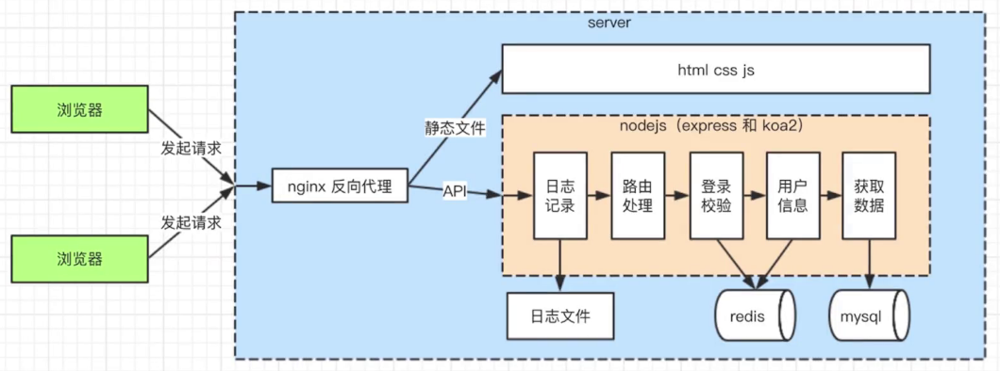

# express后台博客

## 项目流程


## 技术栈
* express + node（主干）
* nginx（反向代理）
* mysql（数据库）
* morgan（日志）
* express-session（用户信息存储session）
* connect-redis、redis（多进程之间session通过redis共享）
* pm2（进程守护）
* xss（xss攻击）
* loginCheck（登录校验）

## 项目运行（已安装nginx、redis、mysql）
1. `npm install`
2. 启动mysql
3. `brew services start nginx` 开启nginx
4. `npm install http-server -g`
5. `cd static/html & http-server -p 9002`代理前端静态页面
6. `cd ../.. & npm run dev`

## 项目目录结构
```
- bin（服务）
- conf（mySQL和Redis连接配置）
- controller（sql查询）
  - blog（博客sql）
  - user（用户）
- db（数据库）
  - mysql
  - redis
- lib（工具库）
  - like-express（express实现原理）
  - test（测试文件）
- log（morgan日志）
  - access（访问日志）
- logs（pm2日志）
  - error（错误日志）
  - out（收集项目中console输出的日志）
- middle（中间件）
  - loginCheck（检查登录中间件）
- model（response消息模板）
- public（静态资源文件）
- routes（路由）
- static
  - html（前端页面）
- utils（工具）
 - crop（密码加密）
- app（main.js）
- nginx.conf（nginx配置）
```

### 项目总结
#### express
```
npm install express-generator -g 
express appName
cd appName && npm i && npm run dev
```

#### 系统安全
##### XSS：窃取前端的cookie内容
* 攻击方式
  > 在页面展示的内容中掺杂js代码(<script>alert("xss");</script>)，以获取网页信息
* 预防措施（转换生成js的特殊字符）
  ```
    npm i xss --save（通过xss包）
    var xss = require('xss');
    var html = xss('<script>alert("xss");</script>');
    console.log(html);
    // &lt;script&gt;alert("xss");&lt;/script&gt;
  ```

##### sq注入：窃取数据库内容
* 最原始、最简单的攻击，从有了web2.0就有了sql注入攻击
* 攻击方式：输入一个sql片段（username '-—' ;delete from users），最终拼接成一段攻击代码
* 预防措施：使用mysql的escape函数处理输入内容即可

##### 明文密码加密（md5加密）保障用户信息安全

#### 单进程、多进程和redis
* 操作系统会限制一个进程的最大可用内存
* 单进程无法充分利用机器全部内存
* 单进程无法充分利用多核CPU的优势
* 多进程之间，内存无法共享
* 多进程可以通过访问一个redis，实现数据共享

#### pm2 进程守护
* 使用价值
  * 守护进程，系统崩溃时自动重启
  * 启动多进程，充分利用CPU和内存
  * 自带日志记录功能（通过console.log、console.error收集日志）
* 安装
  * `npm install pm2 -g`
  * `pm2 --version`
* 常用命令
  * `pm2 list` 查看pm2列表
  * `pm2 start appId/appName/configPath`  启动
  * `pm2 restart appId/appName`  重新启动
  * `pm2 stop appId/appName` 停止
  * `pm2 delete appId/appName` 删除
  * `pm2 log appId/appName`   查看日志
  * `pm2 show appId/appName`  查看详细状态信息
  * `pm2 info appId/appName`  查看详细状态信息
  * `pm2 monit appId/appName` 监控每个 node 进程的 cpu 和内存使用情况
* 配置文件
  ```
  {
    "apps":{
      "name": "koa2-blog", // appName
      "script":"bin/www",  // 启动文件地址
      "instances": 4,   //进程个数
      "watch": true,  //监控变化的目录，一旦变化，自动重启
      "ignore_watch":[  // 忽视这些目录的变化
        "node_modules",
        "logs"
      ],
      "error_file":"logs/error.log", // 错误日志路径
      "out_file":"logs/out.log",  // 普通日志路径
      "log_date_format":"YYYY-MM-DD HH:mm:ss" // 日志时间格式化方式
    }
  }
  ```


